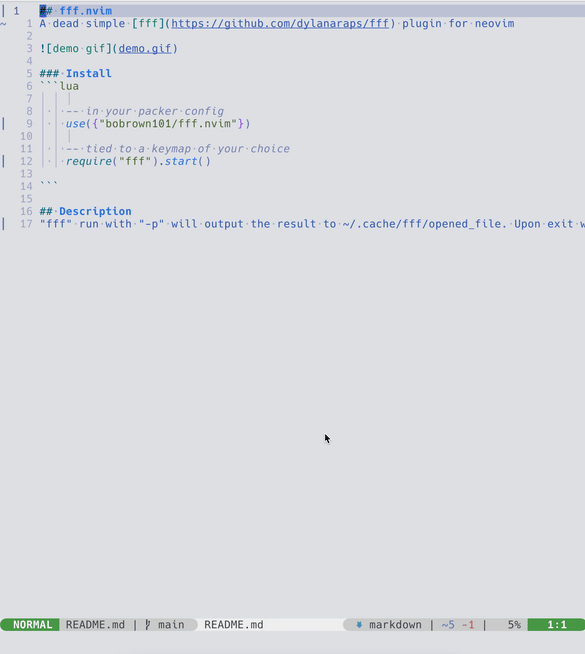

## fff.nvim
A dead simple [fff](https://github.com/dylanaraps/fff) plugin for neovim



### Install
```lua

    -- in your packer config
    use({"bobrown101/fff.nvim"})

    -- tied to a keymap of your choice
    require("fff").start()

```

## Description
"fff" run with "-p" will output the result to ~/.cache/fff/opened_file. Upon exit we read the file, and open it
